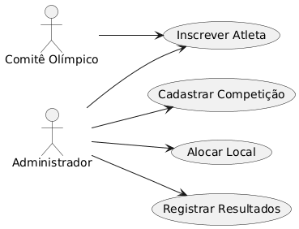
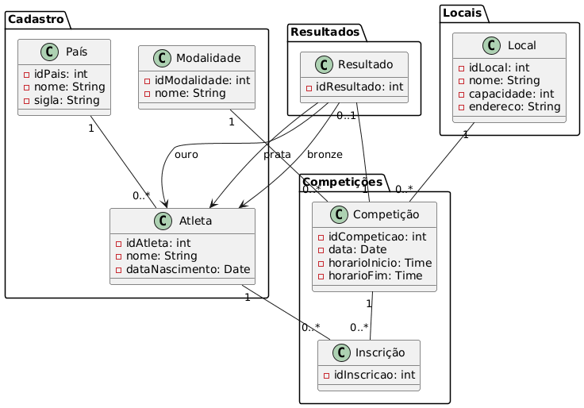
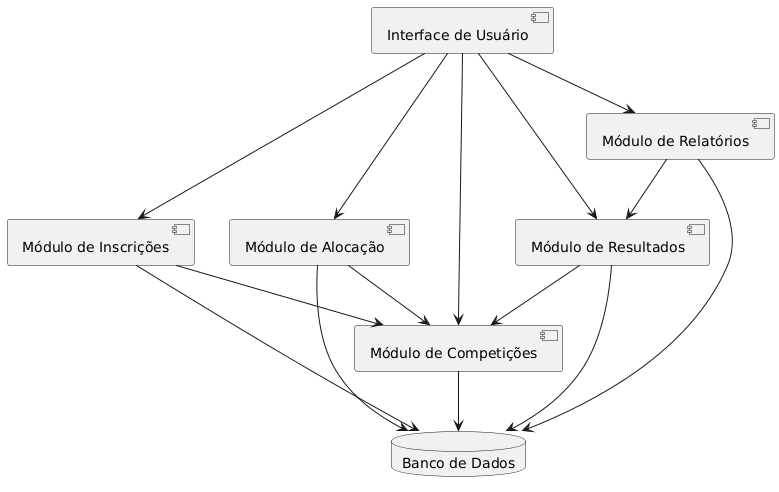
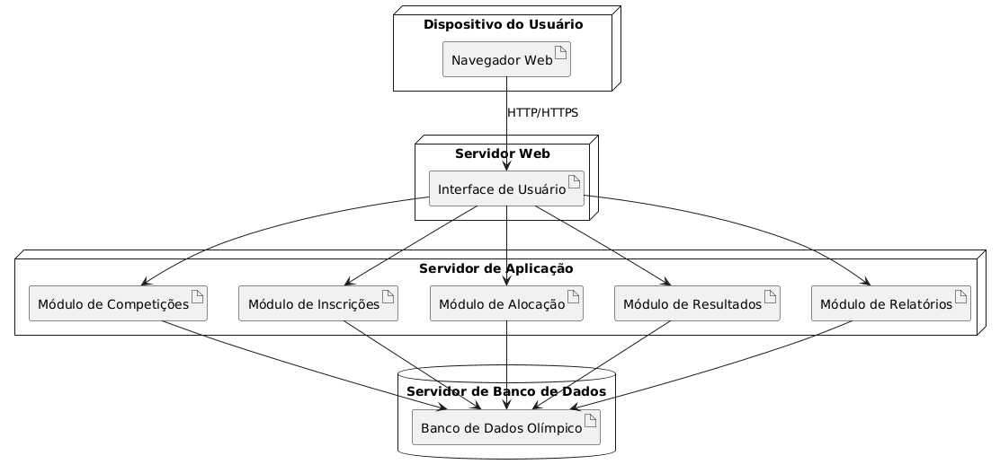

# Sistema de Gestão das Olimpíadas

## Descrição do Sistema

O Sistema de Gestão das Olimpíadas tem como objetivo coordenar os principais processos relacionados às competições olímpicas, permitindo o gerenciamento de competições, inscrições de atletas, alocação de locais para as provas, registro de resultados e geração de relatórios de medalhas por país.

O sistema foi modelado para garantir organização, controle e integridade das informações durante o evento.

---

## Funcionalidades Principais

### Cadastro de Competições

O sistema permite cadastrar competições informando:

- Nome da modalidade;
- Data;
- Horário;
- Local da competição;
- Lista de atletas inscritos.

---

### Inscrição de Atletas

O sistema permite que atletas de diferentes países sejam inscritos em competições específicas.

Cada atleta pode participar de várias competições, respeitando a regra de que só pode representar um país em cada modalidade.

---

### Alocação de Locais

O sistema permite alocar locais para as competições, evitando conflitos de horário.

Um local só pode receber uma competição por vez.

---

### Registro de Resultados

Após a realização das competições, o sistema permite registrar os resultados, indicando:

- Atleta vencedor;
- Segundo colocado;
- Terceiro colocado.

---

### Relatório de Medalhas

O sistema permite gerar relatórios de medalhas por país, apresentando:

- Medalhas de ouro;
- Medalhas de prata;
- Medalhas de bronze;
- Total de medalhas.

---

## Regras de Negócio

1. Toda competição deve possuir modalidade, data, horário e local definidos.
2. Um atleta pode participar de várias competições.
3. Um atleta só pode representar um país em cada modalidade.
4. Um local não pode receber mais de uma competição no mesmo horário.
5. Os resultados devem ser registrados somente após a realização da competição.
6. O relatório de medalhas deve contabilizar ouro, prata e bronze por país.

---

## Estrutura do Sistema

O sistema é organizado em módulos principais:

- Interface de Usuário;
- Módulo de Competições;
- Módulo de Inscrições;
- Módulo de Alocação;
- Módulo de Resultados;
- Módulo de Relatórios;
- Banco de Dados.

---

## Histórias de Usuário

### História de Usuário 1 — Cadastro de Competição

Como administrador do sistema,  
quero cadastrar competições com modalidade, data, horário e local,  
para que as provas olímpicas sejam organizadas corretamente.

---

### História de Usuário 2 — Inscrição de Atleta

Como comitê olímpico,  
quero inscrever atletas em competições específicas,  
para que eles possam participar das modalidades em que estão habilitados.

---

### História de Usuário 3 — Registro de Resultados

Como administrador do sistema,  
quero registrar os atletas classificados em primeiro, segundo e terceiro lugar,  
para que o sistema contabilize corretamente as medalhas conquistadas por cada país.

---

## Tecnologias Utilizadas

- PlantUML para modelagem dos diagramas;
- Sistema web para interação com os usuários;
- Banco de dados para armazenamento das informações;
- Servidor de aplicação para processamento das regras de negócio.

---

## Diagramas Desenvolvidos

Foram desenvolvidos os seguintes diagramas para representar o sistema:

### Diagrama de Caso de Uso

---

### Diagrama de Classes e Pacotes

---

### Diagrama de Componentes

---

### Diagrama de Implantação

---

## Objetivo Final

O objetivo final do sistema é facilitar o gerenciamento das Olimpíadas, garantindo que competições, atletas, locais, resultados e medalhas sejam controlados de forma organizada, segura e eficiente.
